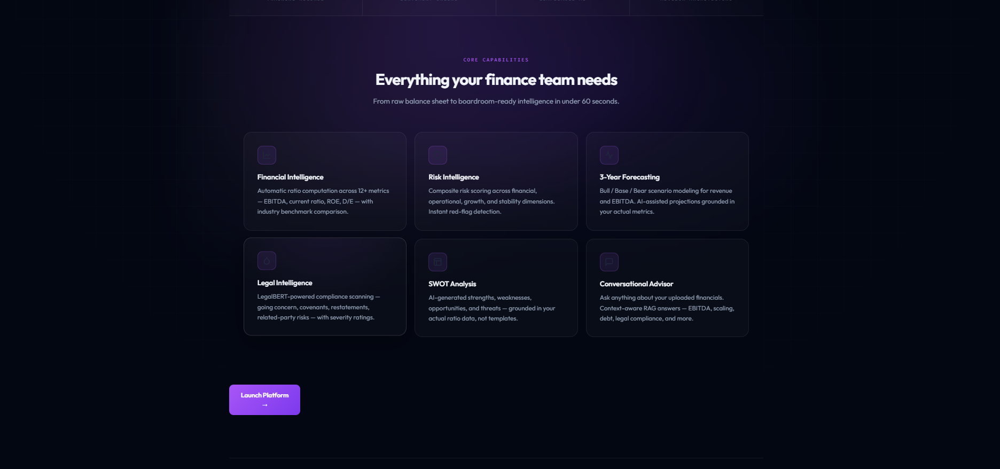

# FinVision AI

<p align="center">
  
</p>

<p align="center">
AI-powered financial intelligence platform combining financial analysis, LegalBERT compliance intelligence, forecasting, RAG pipelines, and conversational AI for enterprise-grade balance sheet assessment.
</p>

---

# Overview

FinVision AI is an intelligent financial analysis and risk intelligence platform designed to transform raw balance sheets into boardroom-ready strategic insights.

The platform combines:
- Financial intelligence
- Risk scoring
- Legal intelligence
- Forecasting
- SWOT generation
- Conversational AI
- RAG-based financial advisory systems

Built with:
- FinBERT
- LegalBERT
- Reinforcement learning workflows
- Retrieval-Augmented Generation (RAG)
- Deep financial analytics pipelines

---

# Core Features

- Financial statement intelligence
- AI-generated risk reports
- Legal compliance analysis
- EBITDA & ratio benchmarking
- AI forecasting engine
- Conversational financial advisor
- SWOT intelligence generation
- PDF report exporting
- Financial health scoring
- Risk dimension analysis
- RAG-powered financial assistant

---

# Platform Showcase

## Financial Intelligence Engine


---

## Financial Metrics & Risk Scoring


---

## AI Financial Advisor


---

## Risk Intelligence & Forecasting


---

## Platform Capabilities



---

# Architecture

FinVision AI combines multiple intelligence layers:

- Financial Intelligence Layer
- Legal Intelligence Layer
- Forecasting Engine
- Retrieval-Augmented Generation
- Conversational Advisory System
- Risk Scoring Pipeline
- Strategic Recommendation Engine

---

# Technology Stack

## Frontend
- React.js
- TailwindCSS
- Framer Motion
- Recharts

## Backend
- Python
- FastAPI
- Flask
- Gradio

## AI & ML
- PyTorch
- Transformers
- FinBERT
- LegalBERT
- Reinforcement Learning Pipelines
- RAG Architecture

## Data Processing
- Pandas
- NumPy
- Scikit-learn

---

# Example Capabilities

- EBITDA analysis
- Financial health scoring
- Revenue forecasting
- Legal compliance scanning
- Risk benchmarking
- Operational weakness detection
- Strategic recommendations
- Conversational financial querying

---

# Repository Structure

```bash
FinVision-AI/
│
├── README.md
├── LICENSE
├── requirements.txt
├── .gitignore
│
├── assets/
├── docs/
├── examples/
├── frontend/
├── backend/
├── models/
└── demo/
```

---

# Note

This repository showcases:
- interface systems
- AI integration pipelines
- financial intelligence workflows
- architecture concepts
- enterprise analysis systems

Proprietary orchestration systems, production infrastructure, deployment pipelines, internal datasets, and advanced model training workflows are not publicly released.

---

# Future Roadmap

- Real-time financial ingestion
- Enterprise dashboarding
- Multi-document intelligence
- Automated compliance workflows
- Institutional analytics
- Investor intelligence systems
- Advanced forecasting models
- Multi-agent financial reasoning

---

# FinVision AI

AI-powered financial intelligence for modern enterprises.
