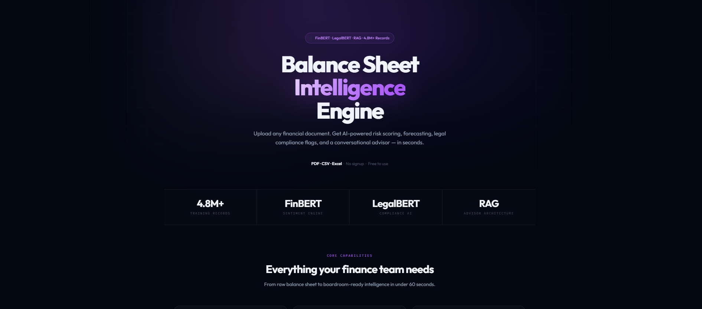
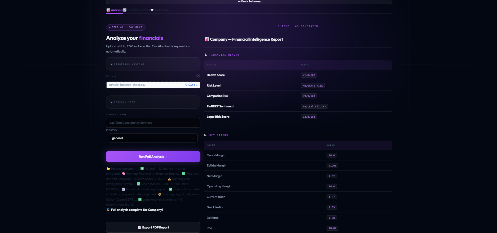
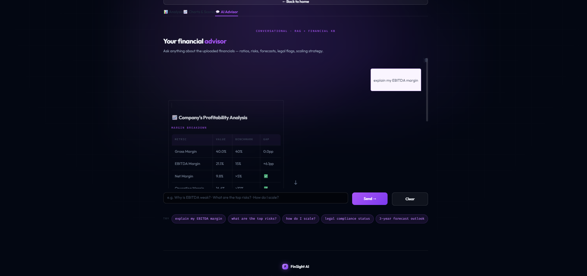

# FinVision AI

> **Proprietary AI Venture · Launching Soon**

> <p align="center">
  
</p>

AI-powered financial intelligence platform combining FinBERT, LegalBERT, RAG pipelines, forecasting, risk analysis, and conversational financial advisory — built for enterprise-grade balance sheet assessment.

---

## What It Does

FinVision AI transforms raw financial documents into boardroom-ready strategic intelligence. It doesn't just read numbers — it reasons about them, flags risks, benchmarks performance, checks legal compliance, and delivers actionable recommendations through a conversational interface.

Built for CFOs, investors, and financial analysts who need deep AI-powered insight, not just dashboards.

---

## Core Capabilities

- Financial statement intelligence and ratio analysis
- Multi-dimensional risk scoring engine
- Legal compliance intelligence (Indian regulatory frameworks)
- EBITDA benchmarking and forecasting
- AI-generated SWOT reports
- Conversational financial advisor (RAG-powered)
- PDF report generation
- Financial health scoring

---

## Architecture

FinVision AI is built as a multi-layer intelligence system:

```
Input Layer          →  Financial documents, balance sheets, filings
Financial Layer      →  FinBERT-powered ratio and statement analysis
Legal Layer          →  LegalBERT compliance and regulatory scanning
Forecasting Layer    →  LSTM-based trend prediction and risk projection
RAG Layer            →  Retrieval-Augmented Generation for advisory context
Advisory Layer       →  Conversational AI financial advisor
Output Layer         →  Risk scores, reports, SWOT, recommendations
```

---

## Technology Stack

**AI / ML**
- PyTorch · Transformers · FinBERT · LegalBERT
- Reinforcement Learning · RAG Architecture · LSTM

**Backend**
- Python · FastAPI · Flask · Gradio

**Frontend**
- React.js · TailwindCSS · Recharts · Framer Motion

**Data**
- Pandas · NumPy · Scikit-learn · Vector Databases

---

## Platform Preview

### Financial Intelligence Engine


### Financial Metrics & Risk Scoring


### AI Financial Advisor


### Risk Intelligence & Forecasting


---

## Proprietary Notice

> This repository documents the system architecture, research methodology, platform design, and capability overview of FinVision AI.
>
> Core model weights, training infrastructure, production backend systems, internal datasets, and deployment pipelines are **proprietary and not publicly released** as this platform is under active development for commercial launch.
>
> For partnership or investment inquiries: **ribhavsoni19@gmail.com**

---

## Founder

**Ribhav Soni** — ML Engineer · AI Researcher · Founder

- 9.8/10 GPA, Pune Institute of Computer Technology
- 4 international research publications
- Barclays Hackathon winner

[github.com/Ribhav19](https://github.com/Ribhav19) · ribhavsoni19@gmail.com
